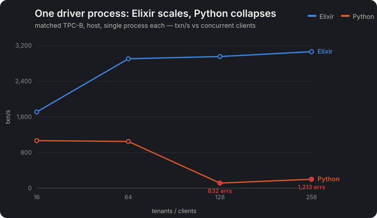
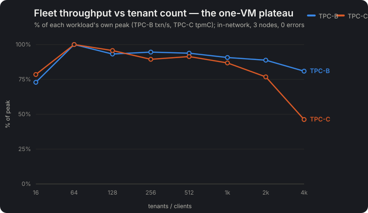
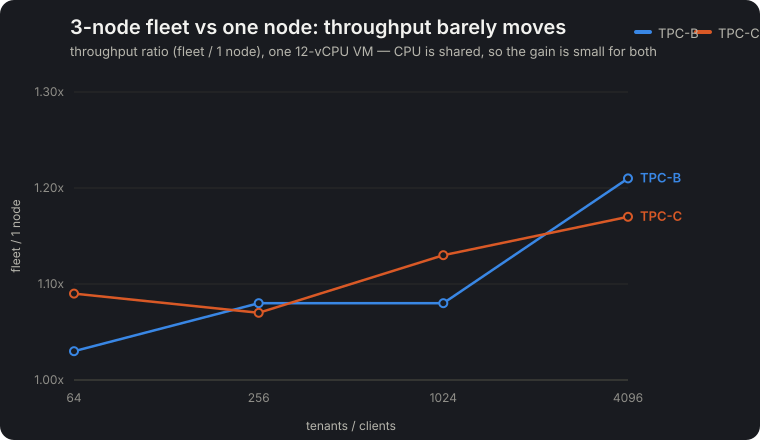
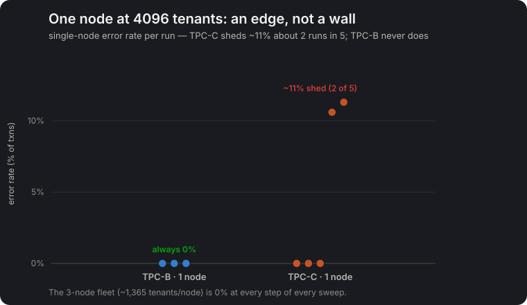

# TPC-* scaling story — 2026-07-24 (charts)

Four charts summarizing the `tpc-*` benchmark line (Elixir/Filo.Client driver, tenant fleets, single-
node baselines). Full methodology, numbers, and caveats in the linked reviews. All figures are from the
one-host chaos rig (3 prod-release nodes + LB + MinIO on a single 12-vCPU colima VM), so absolutes are
relative — the scaling axis is the even per-node split, not the one-box aggregate.

## 1 · Why the driver is Elixir

Matched TPC-B, one process each, host. Elixir climbs to ~3k txn/s; a single Python process **collapses
at ≥128 clients** (GIL + stale-keepalive churn — 632 / 1,213 transient errors). That collapse is why
the load driver was rewritten over `Filo.Client`. → [`tpc-fleet-elixir-driver`](tpc-fleet-elixir-driver-2026-07-24.md)

## 2 · Fleet throughput plateaus on one VM

Aggregate throughput (indexed to each workload's own peak — TPC-B txn/s, TPC-C tpmC, since the units
differ) rises to ~64 tenants, holds through ~1k, then declines as the single 12-vCPU VM saturates.
**0 errors at every step, 16→4096 tenants**; the load partitions evenly (≤1.15× spread) across the 3
nodes. The decline at the high end is one-VM contention (driver + 3 nodes + the seed burst share it).

## 3 · Fleet vs one node: throughput barely moves

Same tenant counts through the LB (3 nodes) vs direct at one node. The throughput ratio is only
**~1.0–1.2×** for *both* workloads — one BEAM node already uses all 12 cores, so three node-processes on
the same silicon just share them. Raw ~N× throughput needs N *separate* machines.

## 4 · The single-node edge — non-deterministic, not a wall

The partition's real value on one VM is **headroom**. One node holding all 4,096 *heavy* (TPC-C)
tenants sits at a resource edge: five runs shed `0, 0, 0, 8.7k, 9.2k` errors (~11% twice). TPC-B — and
a same-weight TPC-B with a matched ~4,000-row data footprint — **never** sheds, so it's TPC-C's held-
stream transaction complexity (more concurrent open write-transactions per node), not data. The 3-node
fleet (~1,365 tenants/node) is 0 errors at every step. *(An earlier draft reported the single 8,700-error
run as a hard wall; the re-runs corrected it to this intermittent edge.)*

## Sources

- Driver A/B + TPC-B tenant fleet + single-node baseline → [`tpc-fleet-elixir-driver-2026-07-24.md`](tpc-fleet-elixir-driver-2026-07-24.md)
- TPC-C driver + the Filo.Client stream-resume fix + TPC-C fleet + single-node → [`tpcc-elixir-driver-2026-07-24.md`](tpcc-elixir-driver-2026-07-24.md)
- Charts generated by `scripts/` in the session scratchpad (data transcribed from the runs above); palette = the dataviz default (validated).
